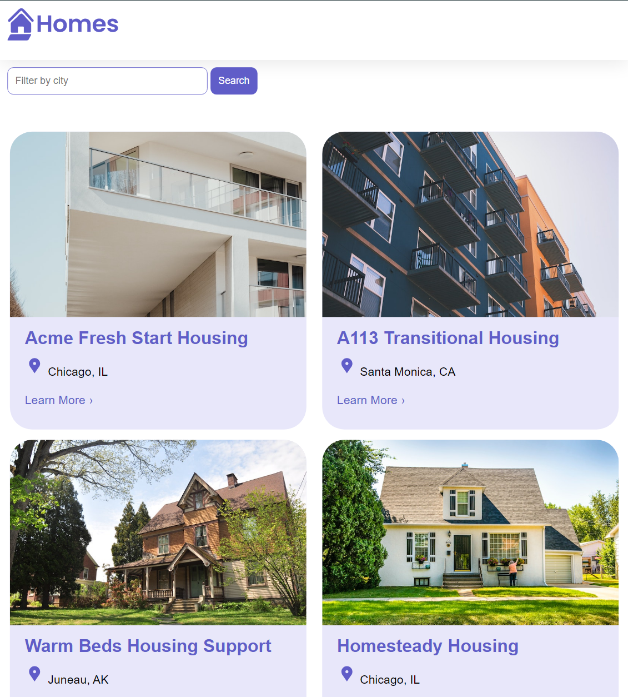
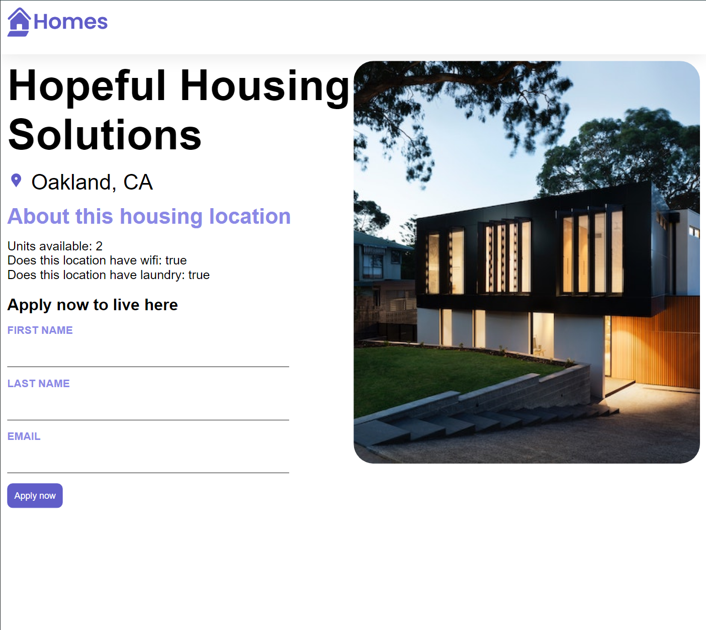

# Angular Homes App

This mini-project is a frontend application made with Angular following the YouTube tutorial: [Learning Angular](https://www.youtube.com/playlist?list=PL1w1q3fL4pmj9k1FrJ3Pe91EPub2_h4jF). I learned the essentials of Angular, including
1. Making components and using them in other components
2. Routing using the anchor tag and the [routerLink] attribute
3. Creating services and injecting them into components
4. Using a Reactive form
5. Using HTTP requests to fetch data




## Installation

If you would like to run the project locally, follow the steps below. 

1. Install Angular if you don't have it installed
```
npm install -g @angular/cli
```
2. Clone this branch to your local machine
```
git clone https://github.com/patb-github/homes-app.git`
```
3. Once the code has been downloaded
```
cd homes-app
```
4. Install the depencies
```
npm install
```
5. Run the application 
```
ng serve
```
6. Unlike the tutorial, which used the json-server, I made an Express server. So, in another terminal window, run
```
node express.js
```

## Credits

This project follows the [Learning Angular](https://www.youtube.com/playlist?list=PL1w1q3fL4pmj9k1FrJ3Pe91EPub2_h4jF) series created by the Angular team.

## License

This project is licensed under the MIT License.